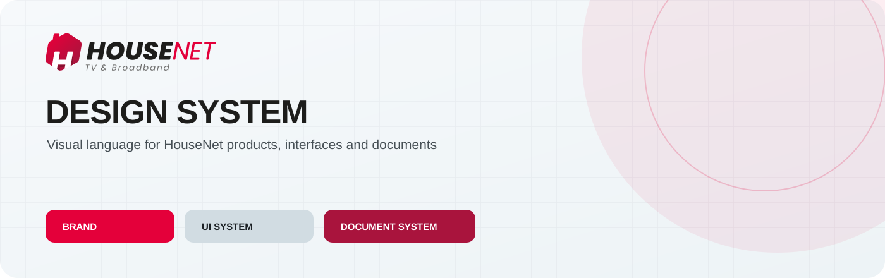
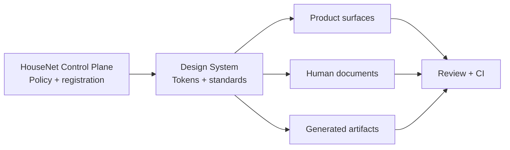

## English

<picture><source media="(prefers-color-scheme: dark)" srcset="assets/brand/derived/design-system-hero-dark.svg"><source media="(prefers-color-scheme: light)" srcset="assets/brand/derived/design-system-hero-light.svg"></picture>

<strong>HOUSE NET · DESIGN SYSTEM</strong> Reusable visual and document authority for HouseNet products, interfaces and documents.

 <a href="house-net-control.json">CLASS B · PUBLIC</a> <a href="docs/VERSION.md">VERSION 1.1.0</a>

<!-- housenet-generated: design-status:start -->
| STATUS | VERSION | CLASS | CONTROL PLANE | LANGUAGE |
| :--- | :--- | :--- | :--- | :--- |
| **ACTIVE** | **1.1.0** | **B — STANDARD** | **Policy 1.4.3** | **EN + HY** |
<!-- housenet-generated: design-status:end -->

The Design System is the reusable visual authority for the HouseNet ecosystem. It gives products, interfaces, documents and generated artifacts a shared language while leaving each surface room for its own purpose.

### System map

| Domain | Owns | Start here |
| :--- | :--- | :--- |
| **Brand** | Official logo provenance, palette, clear space and presentation assets | [`assets/brand/BRAND.md`](assets/brand/BRAND.md) · [`tokens/brand-tokens.json`](tokens/brand-tokens.json) |
| **UI** | Layout, components, states, accessibility and responsive behavior | [`docs/UI-SYSTEM.md`](docs/UI-SYSTEM.md) · [`examples/ui/`](examples/ui/) |
| **Documents** | Word, PowerPoint, Excel and PDF standards, sources and validators | [`documents/README.md`](documents/README.md) · [`documents/templates/`](documents/templates/) |
| **Presentation** | GitHub heroes, social previews, diagrams and status surfaces | [`assets/social/`](assets/social/) · [`docs/DESIGN-LANGUAGE.md`](docs/DESIGN-LANGUAGE.md) |

### Consumption flow

1. Read the current [`house-net-control.json`](house-net-control.json) and canonical Control Plane policy.
2. Use the token sources in [`tokens/`](tokens/); do not copy colors by guesswork.
3. Choose the relevant visual category and document standard.
4. Keep human-facing material complete in English and Armenian.
5. Run `python validators/validate_design_system.py .` and `bin/check-version-consistency .` before publishing.

### Navigation

[`Brand`](assets/brand/BRAND.md) · [`Design language`](docs/DESIGN-LANGUAGE.md) · [`UI system`](docs/UI-SYSTEM.md) · [`Documents`](documents/README.md) · [`Tokens`](docs/TOKENS.md) · [`Accessibility`](docs/ACCESSIBILITY.md) · [`Versioning`](docs/VERSION.md) · [`Enforcement`](docs/ENFORCEMENT.md)

## Հայերեն

<strong>HOUSE NET · ԴԻԶԱՅՆԻ ՀԱՄԱԿԱՐԳ</strong> HouseNet-ի արտադրանքների, միջերեսների, փաստաթղթերի և գեներացվող նյութերի վերօգտագործվող տեսողական իրավասությունը։

<!-- housenet-generated: design-status-hy:start -->
| ԿԱՐԳԱՎԻՃԱԿ | ՏԱՐԲԵՐԱԿ | ԴԱՍ | CONTROL PLANE | ԼԵԶՈՒ |
| :--- | :--- | :--- | :--- | :--- |
| **ԱԿՏԻՎ** | **1.1.0** | **B — STANDARD** | **Policy 1.4.3** | **EN + HY** |
<!-- housenet-generated: design-status-hy:end -->

Design System-ը HouseNet-ի էկոհամակարգի վերօգտագործվող տեսողական իրավասությունն է։ Այն միավորում է արտադրանքների, միջերեսների, փաստաթղթերի և գեներացվող նյութերի լեզուն՝ յուրաքանչյուր մակերեսի նպատակին համապատասխան ազատություն պահպանելով։

### Համակարգի քարտեզ

| Տիրույթ | Պատասխանատվություն | Սկսեք այստեղ |
| :--- | :--- | :--- |
| **Brand** | Պաշտոնական լոգոյի աղբյուր, գույներ, clear space և ներկայացման asset-ներ | [`assets/brand/BRAND.md`](assets/brand/BRAND.md) · [`tokens/brand-tokens.json`](tokens/brand-tokens.json) |
| **UI** | Layout, components, states, accessibility և responsive վարք | [`docs/UI-SYSTEM.md`](docs/UI-SYSTEM.md) · [`examples/ui/`](examples/ui/) |
| **Փաստաթղթեր** | Word, PowerPoint, Excel և PDF ստանդարտներ, source-ներ և validators | [`documents/README.md`](documents/README.md) · [`documents/templates/`](documents/templates/) |
| **Ներկայացում** | GitHub hero-ներ, social preview-ներ, diagram-ներ և status մակերեսներ | [`assets/social/`](assets/social/) · [`docs/DESIGN-LANGUAGE.md`](docs/DESIGN-LANGUAGE.md) |

### Օգտագործում

1. Կարդացեք ընթացիկ [`house-net-control.json`](house-net-control.json)-ը և Control Plane-ի canonical policy-ն։
2. Օգտագործեք [`tokens/`](tokens/)-ի աղբյուրները․ գույները մի կրկնօրինակեք ենթադրությամբ։
3. Ընտրեք համապատասխան visual category-ն և փաստաթղթի standard-ը։
4. Մարդկանց համար նախատեսված նյութերը պահեք ամբողջական English + Հայերեն ձևաչափով։
5. Հրապարակելուց առաջ գործարկեք `python validators/validate_design_system.py .` և `bin/check-version-consistency .`։

### Նավիգացիա

[`Brand`](assets/brand/BRAND.md) · [`Design language`](docs/DESIGN-LANGUAGE.md) · [`UI system`](docs/UI-SYSTEM.md) · [`Փաստաթղթեր`](documents/README.md) · [`Tokens`](docs/TOKENS.md) · [`Accessibility`](docs/ACCESSIBILITY.md) · [`Versioning`](docs/VERSION.md) · [`Enforcement`](docs/ENFORCEMENT.md)
