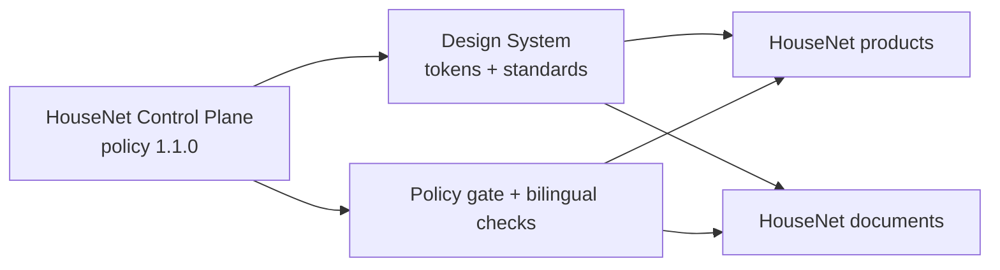

## English

<picture><source media="(prefers-color-scheme: dark)" srcset="assets/brand/derived/design-system-hero-dark.svg"><source media="(prefers-color-scheme: light)" srcset="assets/brand/derived/design-system-hero-light.svg"></picture>

<strong>HOUSE NET · DESIGN SYSTEM</strong> Canonical visual language for HouseNet products, interfaces and documents.

 <a href="house-net-control.json">Class B · Private</a> <a href="docs/VERSION.md">v1.0.0</a>

| STATUS | VERSION | CLASS | CONTROL PLANE | LANGUAGE |
| :--- | :--- | :--- | :--- | :--- |
| **ACTIVE** | **1.0.0** | **B — STANDARD** | **Policy 1.2.0** | **EN + HY** |

The design system is the reusable HouseNet source for three connected systems:

| System | Owns | Start here |
| :--- | :--- | :--- |
| **Brand System** | Official logo provenance, palette, clear space and presentation assets | [`assets/brand/BRAND.md`](assets/brand/BRAND.md) · [`tokens/brand-tokens.json`](tokens/brand-tokens.json) |
| **UI System** | Portable layout, components, states, accessibility and responsive rules | [`docs/UI-SYSTEM.md`](docs/UI-SYSTEM.md) · [`examples/ui/`](examples/ui/) |
| **Document System** | Word, PowerPoint, Excel and PDF standards, sources and validators | [`documents/README.md`](documents/README.md) · [`documents/templates/`](documents/templates/) |

## Control flow

## Consumption

1. Read the current [`house-net-control.json`](house-net-control.json) and canonical control-plane policy.
2. Load the token source from [`tokens/`](tokens/), never copy colors into a product by guesswork.
3. Follow the relevant UI or document standard and keep human-facing material EN + HY.
4. Run `python validators/validate_design_system.py .` before publishing a derived artifact.

## Navigation

[`Brand`](assets/brand/BRAND.md) · [`UI system`](docs/UI-SYSTEM.md) · [`Document system`](documents/README.md) · [`Token contract`](docs/TOKENS.md) · [`Accessibility`](docs/ACCESSIBILITY.md) · [`Versioning`](docs/VERSION.md) · [`Control-plane enforcement`](docs/ENFORCEMENT.md)

## Հայերեն

<strong>HOUSE NET · ԴԻԶԱՅՆԻ ՀԱՄԱԿԱՐԳ</strong> HouseNet-ի արտադրանքների, միջերեսների և փաստաթղթերի կանոնական տեսողական լեզուն։

| ԿԱՐԳԱՎԻՃԱԿ | ՏԱՐԲԵՐԱԿ | ԴԱՍ | CONTROL PLANE | ԼԵԶՈՒ |
| :--- | :--- | :--- | :--- | :--- |
| **ԱԿՏԻՎ** | **1.0.0** | **B — STANDARD** | **Policy 1.2.0** | **EN + HY** |

Դիզայնի համակարգը HouseNet-ի երեք կապակցված համակարգերի վերօգտագործվող աղբյուրն է՝ Brand System՝ պաշտոնական լոգոյի աղբյուր, գունային համակարգ և clear-space կանոններ, UI System՝ layout, components, states, accessibility և responsive կանոններ, Document System՝ Word, PowerPoint, Excel և PDF ստանդարտներ, source-ներ և validators։

### Օգտագործում

1. Կարդացեք ընթացիկ [`house-net-control.json`](house-net-control.json)-ը և canonical control-plane policy-ն։
2. Token-ները բեռնեք [`tokens/`](tokens/)-ից․ գույները մի կրկնօրինակեք ենթադրությամբ։
3. Հետևեք UI-ի կամ փաստաթղթի համապատասխան standard-ին և մարդկային նյութերը պահեք EN + HY։
4. Հրապարակելուց առաջ գործարկեք `python validators/validate_design_system.py .`։

### Նավիգացիա

[`Brand`](assets/brand/BRAND.md) · [`UI system`](docs/UI-SYSTEM.md) · [`Document system`](documents/README.md) · [`Token contract`](docs/TOKENS.md) · [`Accessibility`](docs/ACCESSIBILITY.md) · [`Versioning`](docs/VERSION.md) · [`Control-plane enforcement`](docs/ENFORCEMENT.md)
